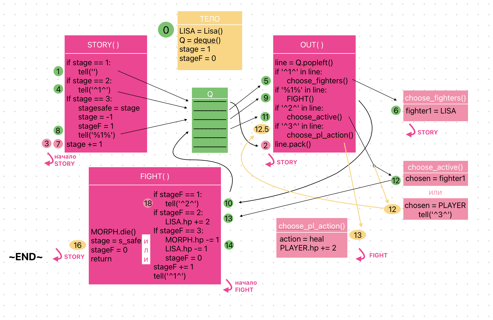

# Text-Based Novella with Turn-Based Combat

This is a **textual interactive story** enriched with **turn-based battles**, multiple endings, and a flexible architecture that makes story scripting extremely convenient. Although we didn't manage to fully implement character arcs and plot twists, the current version demonstrates a wide range of **technical capabilities** suitable for future projects of this kind.

---

## Features Implemented

- **Battle mechanics**
- **Multiple endings** (good / bad)
- **Dynamic interaction system**
- **Story scripting flexibility** (for writers)
- **Branching structure with game states**

---

## Gameplay Tips

- Pay attention to **character names** – your associations might help win the battle  
- Try not to let your allies’ **HP drop to 0**  
- _Any resemblance to real linguists is purely coincidental_
---

## Important Recommendations

- Do **not close pop-up windows** manually – they will close automatically when you click one of the buttons. Closing them forcefully may cause the program to crash  
- If a pop-up does not disappear, try pressing another button  
- Do **not close the main window** – this will terminate the game  
- Use the **scrollbar on the right** to view the full text  
- New messages auto-scroll down, but you can scroll manually if needed  
- If nothing happens after pressing “Continue”, try clicking it again  
- If all characters die in battle – restart the game

